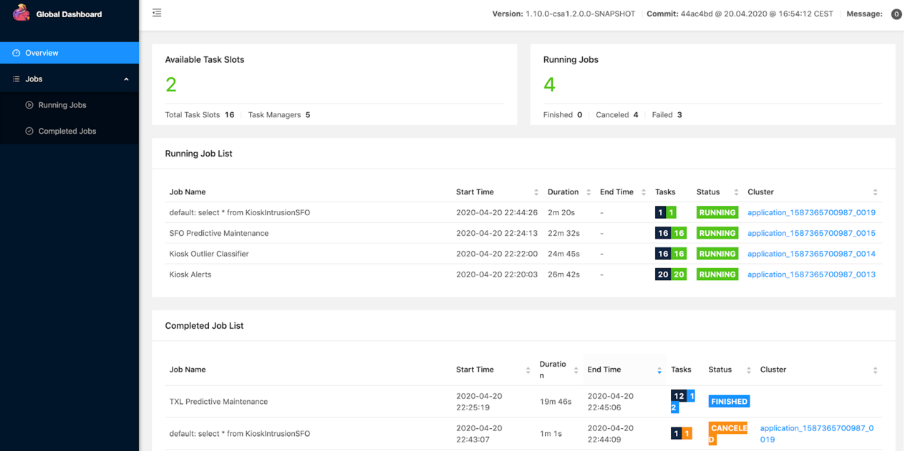

# 🚀 Hiểu về Apache Flink cho người mới bắt đầu

Apache Flink là một hệ sinh thái **xử lý dữ liệu phân tán** theo thời gian thực (streaming) hoặc theo lô (batch), thường được dùng trong các hệ thống lớn để xử lý log, event.

---

## 🎯 Flink là gì?

Nói nôm na: bạn có thể ứng dụng Flink để:

- bước 1: ✍️ **Viết code xử lý dữ liệu** (dùng Java, Scala hoặc Python)
- bước 2: 📦 **Đóng gói thành một file `.jar`** và gửi lên hệ thống
- bước 3: ⚙️ **Chạy job** trên một hoặc nhiều máy (cluster)
- bước 4: 👀 **Quản lý job qua giao diện web UI**

Flink giúp bạn xử lý dữ liệu **liên tục** với độ trễ cực thấp (milliseconds), hỗ trợ **tự động retry khi lỗi**, **stateful processing**, **exactly-once semantics**…

---

## 🧩 Kiến trúc Flink cơ bản

```text
+------------------------+
|     Your Code (JAR)    |
+-----------+------------+
            |
     Submit Job to Flink
            |
   +--------v--------+        Web UI
   |   JobManager    | <----------------+
   +-----------------+                 |
            |                          |
   +--------v--------+        +--------+---------+
   |   TaskManager(s) | <-->  | Flink Dashboard  |
   +------------------+       +------------------+

```

## 🧩 Nhận diện Flink qua 3 phần chính

### 1. Viết logic bằng Flink API

Flink cung cấp các thư viện để bạn viết code xử lý:

- `DataStream API` (phổ biến nhất, dùng cho stream)
- `Table API` và `Flink SQL`
- Dùng được với Java, Scala, hoặc Python

👉 Bạn định nghĩa:
```java
DataStream<String> stream = env.fromSource(...);
DataStream<String> result = stream.map(...).keyBy(...).window(...);
result.sinkTo(...);
```

### 2. Chạy job trên Flink Cluster
1. Code xử lý được đóng gói thành file .jar

2. Nộp lên cluster thông qua Flink CLI hoặc REST API

3. Flink tự phân chia task tới các node (TaskManager)


👉 Sau đó job của bạn sẽ chạy liên tục

### 3. Quản lý qua Flink Dashboard
Flink có UI mặc định chạy ở http://localhost:8081:

Xem job đang chạy, job đã hoàn thành

Theo dõi: throughput, latency, checkpoint, state size

Dừng job, restart, rescale

Xem log lỗi, lỗi task

👉 Đây là nơi Data Engineer thường xuyên ghé thăm để debug và monitor hệ thống.




## 🗂 Ví dụ trực quan – từ code đến chạy
1. Viết code xử lý file Kafka → xử lý → lưu ra PostgreSQL

2. Đóng gói thành stream-job.jar

3. Deploy:
```
./bin/flink run -c my.company.StreamJob stream-job.jar
```
4. Mở dashboard để xem trạng thái

## 🧠 Tổng kết
| Thành phần      | Mô tả                            | Ví dụ                                |
| --------------- | -------------------------------- | ------------------------------------ |
| **Library/API** | Viết logic xử lý dữ liệu         | `DataStream.map().window().sinkTo()` |
| **Runtime**     | Chạy job `.jar` trên cluster     | Set up flink, build job, run job                   |
| **Dashboard**   | Giao diện theo dõi và điều khiển | `http://localhost:8081`              |


Trên đây là góc nhìn của mình, mong được mọi người góp ý thêm!
## Tài liệu tham khảo: 
https://docs.cloudera.com/cdf-datahub/7.3.1/how-to-flink/topics/csa-hs-webui.html